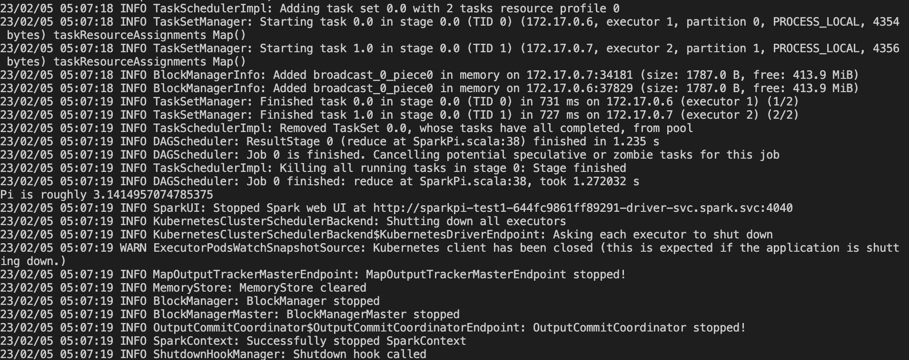

# k8s에 스파크 클러스터 세팅하기 (m1 mac)
## Environments setting
1. Minikube & kubectl 설치
    - Homebrew로 설치
        ```console
        $ brew install minikube
        $ brew install kubectl
        ```
    - ENV & alias 등록
        ```console
        $ source <(kubectl completion zsh)
        $ alias k=kubectl
        $ complete -F __start_kubectl k
        ```   
    - Test
        ```console
        $ k cluster-info dump
        $ minikube --memory 8192 --cpus 4 start 
        ``` 

2. Java 설치
    - https://www.azul.com/downloads/zulu-community/?package=jdk
    에서 jdk11 설치 (ARM version)
    - Java ENV 등록(./~zchrc)
        ```sh
        export JAVA_HOME=/Library/Java/JavaVirtualMachines/zulu-11.jdk/Contents/Home
        export PATH=$PATH:$JAVA_HOME/bin
        ```
    - Test
        ```console
        $ java -version
        $ javac -version
        ```

3. Spark 설치
    - Homebrew로 설치
        ```console
        $ brew install apache-spark
        ```
    - Spark ENV 등록(설치경로에서 버전확인 -> 3.1.1)
        ```sh
        export SPARK_HOME=/opt/homebrew/Cellar/apache-spark/3.1.1/libexec
        export PATH=$PATH:$SPARK_HOME
        ```
    - version 확인
        ```console
        $ pyspark --version
        ```
    - wordcount 예제
        ```console
        $ spark-submit examples/src/main/python/wordcount.py /Users/eumhwa/Desktop/project/k8s_spark_practice/README.md
        ```
    
4. Spark docker image build
    - pod 생성을 위한 base docker image(spark-py) pull받기
    - docker-image-tool.sh 이용
        - -m: minikube docker daemon 이용하여 이미지 받기
        - -p: python job 전용 dockerfile 지정  
        ```console
        $ cd /opt/homebrew/Cellar/apache-spark/3.1.1/libexec
        $ docker-image-tool.sh -m -p kubernetes/dockerfiles/spark/bindings/python/Dockerfile build
        ```

    - pull 받은 docker image 확인
        ```console
        $ docker exec -it minikube bash
        $ docker images |grep spark
        ```

5. Minikube에서 spark job 실행
    - 테스트를 위한 namespace, serviceaccount, role/rolebinding 생성
        ```console
        $ k apply -f ns.yaml
        $ k apply -f sa.yaml
        $ k apply -f sa_role.yaml
        ```
    - 확인
        ```console
        $ k get ns
        $ k get -n spark serviceaccount
        $ k get -n spark rolebinding
        ```
    - spark job 실행 (Pi 계산) 및 실행 log 확인
        ```console
        $ sh example_pi.sh
        $ k logs -n spark -f spark-test1-pi
        $ k delete pods -n spark spark-test1-pi
        ```
    - log 
    
        