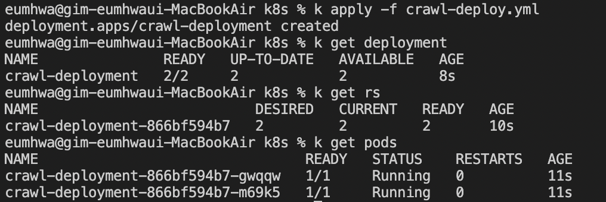
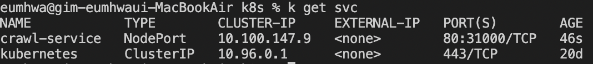
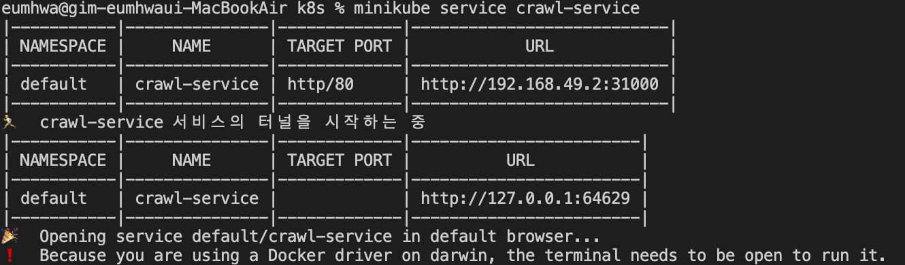
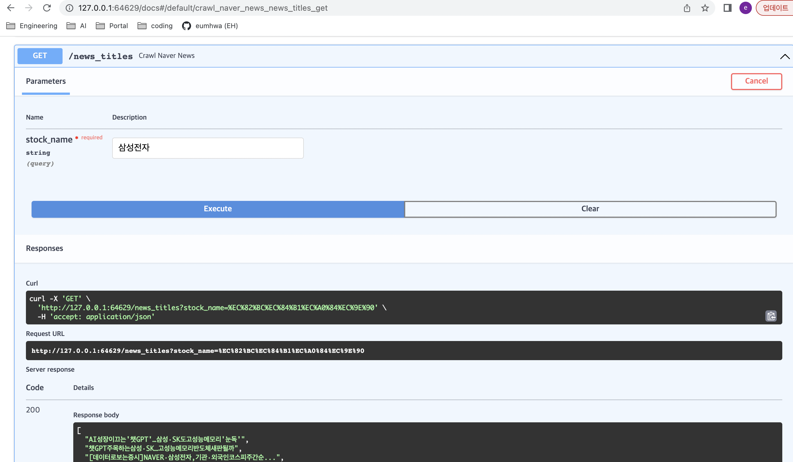
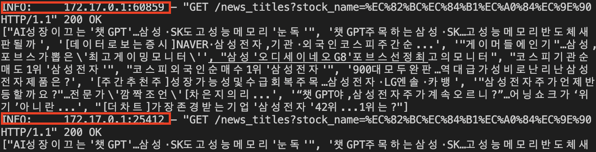

# k8s 에 new crawling application 배포
## Setting: minikube + Container(stock news crawling pod)

1. Minikube 실행 & Docker image 빌드

    - Minikube 실행
        ```
        $ minikube --memory 2048 --cpus 2 start
        ```
    - Docker image build
        - 1번 명령어를 통해 minikube 위에 docker image를 빌드할 수 있다.
        ```console
        $ eval $(minikube -p minikube docker-env) # to use local images
        $ cd ./crawl_app
        $ docker build -t crawl_app:dev .
        ```
    - Container build by buildx (multi-architecture support)
        - setting builder
        ```console
        $ docker buildx create --name mybuilder
        $ docker buildx use mybuilder
        $ docker buildx ls #checking builder
        ```

        - build using docker-buildx
        ```console
        $ docker buildx build --platform darwin/arm64,darwin/amd64 -t crawl_app:dev --load .
        ```
    - running docker container locally
        ```console
        $ docker run -itd -p 8002:8002 --name crawl crawl_app:dev
        ```
2. crawling API 배포
    - deployment 생성(replicaset, pod)
    ```console
    $ k apply -f crawl-deploy.yml
    $ k get deployment
    $ k get rs
    $ k get pods
    ```

    - 실행 화면
    
    
    - service 생성
    ```console
    $ k apply -f crawl-svc.yml # or 다음 커맨드와 동일, 단 nodeport 확인 필요
    $ kubectl expose deployment/crawl-deployment --type="NodePort" --port 80 --target-port=8002 --protocol="TCP"
    $ k get svc
    ```

    - 실행 화면
    

3. Crawling API swagger 접속
    - minikube service 실행 및 app log 확인
    ```console
    $ minikube service crawl-service
    $ k logs -l app=cw-app
    ```
    - 실행 화면
    
    - swagger 실행 화면
    
    - 복제된 2개 pod에 호출
    

## 기타 kubectl commands
- pod create/delete
    ```console
    $ k create -f stock_crawl.yml
    $ k delete -f stock_crawl.yml
    ```
- pod information & checking logs
    ```console
    $ k get pods # all pods
    $ k get pod stock-crawling -o yaml # detailed pod information with yaml format
    $ k describe stock-crawling # events, scheduler
    $ k logs -f stock-crawling --tail 100 # last 100 logs
    ```
- port forwarding
    ```console
    $ k port-forward stock-crawling 8001:8002
    ```
- label & annotation
    ```console
    $ k annotate pod stock-crawling key:value # key/value format
    ```
